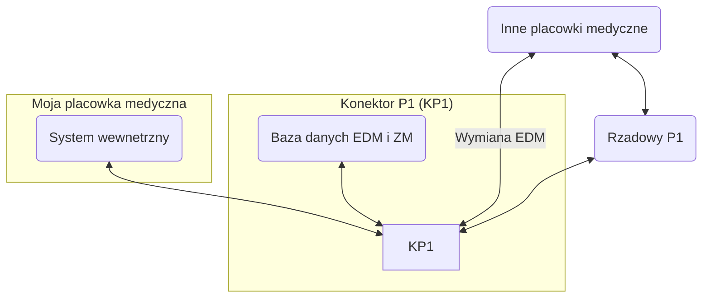
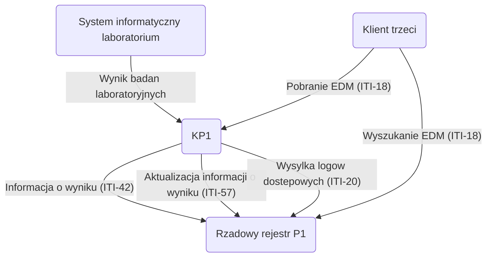

## Konektor P1 (KP1)

Otwarto-zrodlowa implementacja konektora do [systemeu P1 (System e-zdrowie)](https://www.cez.gov.pl/pl/nasze-produkty/e-zdrowie-p1). 

## Obecny zakres implementacji

 - laboratoria medyczne
   - raportowanie wynikow badan laboratoryjnych (ZM, EDM)

## Motywacja

Celem tej implementacji jest umozliwienie **efektywnej** integracji juz istniejacego oprogramowania medycznego z P1.
Na rynku istnieja gotowe rozwiazania od ASSECO, KAMSOFT, CREAMSOFT i innych, ktore sa zamkniete i drogie. 
Dodatkowo dokumentacja P1 jest:
 - trudna w zrozumieniu
 - beznadziejnie sformatowana
 - sklada sie z referencji do wielu innych, skomplikowanych i zagranicznych dokumentacji
 - korzysta z przestarzalych technologii takich jak SOAP
 - wymaga dzialania na systemie Windows, wsparcie dla MacOS jest nieuzyteczne
 - wymaga niezwykle doglebnej wiedzy w zakresie HL7, SOAP, WSS

Dodatkowo praca w innym jezyku programowania niz Java jest mocno utrudniona ze wzgledu na nie-do-konca kompatybilne narzedzia w innych jezykach (.NET svcutil.exe i inne).

## Cel

Ten projekt ma na celu wyjsc na przekor przeciwnosciom jakie zostaly utworzone przez CEZ i zaoferowac rozwiazanie all-in-one.

## Architektura tego projektu

## Zalozenia

Developer, powinien moc z latwoscia zintegrowac sie z systemem P1.

## Stack technologiczny

 - Docker
 - NodeJS
 - PostgreSQL

## Architektura EDM

ITI-41 nie musi byc zaimplementowane bo to komunikacja wewnetrzna szyny.

ITI-1 to po prostu synchronizacja czasu, np. za pomoca ntpd.

## Rozwoj

Zapraszam do forkowania tego repo, dyskusji i kontrybucji.
